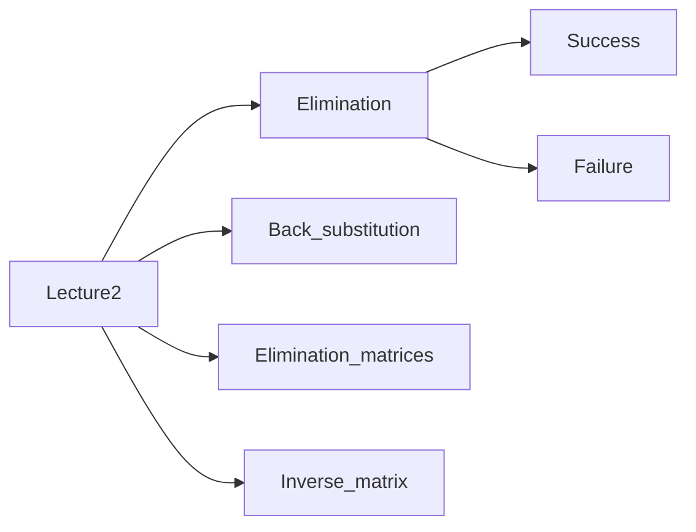

# Lecture1—geometry explainations

## main topics

==n linear equations, n unknowns==

==row picture==

==⭐column picture==

==matrix form==

lines meeting

## coefficient matrix

a matrix == rectangular array of numbers
$$
\begin{cases}2x-y = 0\\
-x+2y = 3\end{cases}
$$

$$
\left[
\matrix{
2 & -1\\
-1 & 2\\
}
\right]

\left[
\matrix{
x\\
y\\
}
\right]

=

\left[
\matrix{
0\\
3\\
}
\right]
\\\\
A x = b
$$

## row picture[2*2]

$$
\begin{cases}2x-y = 0\\
-x+2y = 3\end{cases}
$$

take one row at a time

xy plane

plot all the points that satisfy that first equation

-start with which point on the horizontal line

$$
solution = (1,2)
$$

## column picture[2*2]

$$
\begin{cases}2x-y = 0\\
-x+2y = 3\end{cases}
$$

$$
x
\left[
\matrix{
2\\
-1
}
\right]
+
y
\left[
\matrix{
-1\\
2
}
\right]
=
\left[
\matrix{
0\\
3
}
\right]
$$

combine x vector and y vector in the right amounts to get [0;3]

⭐find right **linear combination**—the most fundamental operation

here is find the linear combination of the columns

algebra -> geometry

==We have known the right combination：==
$$
solution = (1,2)
\\\\
1*
\left[
\matrix{
2\\
-1\\
}
\right]
+
2*
\left[
\matrix{
-1\\
2\\
}
\right]
=
\left[
\matrix{
0\\
3\\
}
\right]
$$

==all the combination?==

The combination of the two would **fill the whole plane**.

## [3*3]

$$
\begin{cases}
2x-y = 0\\
-x+2y-z = -1\\
-3y+4z=4
\end{cases}
$$

$$
A=\left[
\matrix{
2&-1&0\\
-1&2&-1\\
0&-3&4\\
}
\right]
\quad\quad\quad
b=\left[
\matrix{
0\\
-1\\
4\\
}
\right]
$$

**The row picture is hard to draw.**
$$
x
\left[
\matrix{
2\\
-1\\
0\\
}
\right]
+
y
\left[
\matrix{
-1\\
2\\
-3\\
}
\right]
+
z
\left[
\matrix{
0\\
-1\\
4\\
}
\right]
=
\left[
\matrix{
0\\
-1\\
4\\
}
\right]
$$
**obviously:**
$$
solution=
\left[
\matrix{
0\\
0\\
1\\
}
\right]
$$
==change another right-hand side:==
$$
x
\left[
\matrix{
2\\
-1\\
0\\
}
\right]
+
y
\left[
\matrix{
-1\\
2\\
-3\\
}
\right]
+
z
\left[
\matrix{
0\\
-1\\
4\\
}
\right]
=
\left[
\matrix{
1\\
1\\
-3\\
}
\right]
$$

$$
solution=
\left[
\matrix{
1\\
1\\
0\\
}
\right]
$$

## Can I solve Ax=b for every b? 

==Do the "linear combinations of the columns" fill 3-D space?==

A non-singular matrix（非奇异）, an invertible matrix（可逆）

==A singular case==: if these three columns all lie in the same plane, their combinations will lie **in that same plane**!

The matrix would be not invertible. **NOT ALWAYS have a solution!**

## matrix * vector

$$
Ax=b\\
\left[
\matrix{
2&5\\
1&3
}
\right]
\left[
\matrix{
1\\
2
}
\right]\\\\
(1)
\left[
\matrix{
2&5\\
1&3
}
\right]
\left[
\matrix{
1\\
2
}
\right]
=
1*
column1
+
2*
column2
=
1
\left[
\matrix{
2\\
1
}
\right]
+
2
\left[
\matrix{
5\\
3
}
\right]
=
\left[
\matrix{
12\\
7
}
\right]\\
(2)
DotProduct:
\begin{cases}
2*1+5*2=12\\
1*1+3*2=7\\
\end{cases}
$$

(1)Ax is a **combination of columns of A**.

(2)==Dot  Product:==

+ a row at one time
+ dot product

# Lecture2

## elimination(消元法)

### success

$$
\begin{cases}
x+2y+z=2\\
3x+8y+z=12\\
4y+z=2\\
\end{cases}
$$

$$
\left[
\matrix{
\boxed{1}&2&1\\
3&8&1\\
0&4&1\\
}
\right]

\xrightarrow[(2,1):2-1*\colorbox{yellow}{3}]{subtraction}

\left[
\matrix{
\boxed{1}&2&1\\
\colorbox{yellow}{0}&2&-2\\
0&4&1\\
}
\right]

\xrightarrow[(3,1):nothing]{subtraction}

\left[
\matrix{
\boxed{1}&2&1\\
0&2&-2\\
\colorbox{yellow}{0}&4&1\\
}
\right]

\\\\continue\quad recursive...\\\\
\left[
\matrix{
1&2&1\\
0&\boxed{2}&-2\\
0&4&1\\
}
\right]

\xrightarrow[(3,2):3-2*\colorbox{yellow}{2}]{subtraction}

\left[
\matrix{
1&2&1\\
0&\boxed{2}&-2\\
0&\colorbox{yellow}{0}&5\\
}
\right]

\\\\
\left[
\matrix{
\boxed{1}&2&1\\
0&\boxed{2}&-2\\
0&0&\boxed{5}\\
}
\right]

\\U:upper\quad triangular(上三角矩阵)

\\\\
\boxed{pivot(主元)}:cannot \quad be \quad 0\\
multiplier(消元系数)\\
$$

determinant of this matrix（矩阵的行列式）=product of pivots

### failure

fail to come up with three pivots

+ ==temporary failure==:if 0 is in the pivot position, exchange the rows
+ ==complete failure==:but if the final pivot is 0, the matrix would **have not been invertible**

## back substitution(回代)

augmented matrix(增广矩阵)
$$
\begin{cases}
x+2y+z=2\\
3x+8y+z=12\\
4y+z=2\\
\end{cases}
$$

$$
\left[

\begin{matrix}
\boxed{1}&2&1\\
3&8&1\\
0&4&1\\
\end{matrix}
\left|
\,
\begin{matrix}
2\\
12\\
2\\
\end{matrix}
\right.

\right]

\xrightarrow[(2,1):2-1*\colorbox{yellow}{3}]{subtraction}

\left[

\begin{matrix}
\boxed{1}&2&1\\
\colorbox{yellow}{0}&2&-2\\
0&4&1\\
\end{matrix}

\left|
\,
\begin{matrix}
2\\
6\\
2\\
\end{matrix}
\right.

\right]

\xrightarrow[(3,1):nothing]{subtraction}

\left[

\begin{matrix}
\boxed{1}&2&1\\
0&2&-2\\
\colorbox{yellow}{0}&4&1\\
\end{matrix}

\left|
\,
\begin{matrix}
2\\
6\\
2\\
\end{matrix}
\right.

\right]

\\\\continue\quad recursive...\\\\
\left[
\begin{matrix}
1&2&1\\
0&\boxed{2}&-2\\
0&4&1\\
\end{matrix}

\left|
\,
\begin{matrix}
2\\
6\\
2\\
\end{matrix}
\right.

\right]

\xrightarrow[(3,2):3-2*\colorbox{yellow}{2}]{subtraction}

\left[
\begin{matrix}
1&2&1\\
0&\boxed{2}&-2\\
0&\colorbox{yellow}{0}&5\\
\end{matrix}

\left|
\,
\begin{matrix}
2\\
6\\
-10\\
\end{matrix}
\right.

\right]

\\\\
\left[
\begin{matrix}
\boxed{1}&2&1\\
0&\boxed{2}&-2\\
0&0&\boxed{5}\\
\end{matrix}

\left|
\,
\begin{matrix}
2\\
6\\
-10\\
\end{matrix}
\right.

\right]

\Rightarrow

\begin{cases}
x+2y+z=2\\
2y-2z=6\\
5z=-10\\
\end{cases}

\Rightarrow

\begin{cases}
x=2\\
y=1\\
z=-2\\
\end{cases}
\\

\\

[U|c]\Rightarrow Ux=c
$$

It's the simple step solving the equations **in reverse order**, because the system is triangular（三角）.

## elimination matrices(矩阵消元)

1.how these matrices work **by rows as well as by columns:**

==左乘取自己行（行变换），右乘取自己列（列变换）：==
$$
(1)By\quad columns(右乘:矩阵列的线性组合)\\
\left[
\matrix{
2&5\\
1&3
}
\right]
\left[
\matrix{
1\\
2
}
\right]
=
1*
column1
+
2*
column2
\\
\colorbox{yellow}{matrix*column=column}
\\

(2)By\quad rows(左乘:矩阵行的线性组合)\\
\left[
\matrix{
1&2&7
}
\right]
\left[
\matrix{
2&5\\
1&3
}
\right]
=
1*row1
+
2*row2
+
7*row3

\\
\colorbox{yellow}{row*matrix=matrix}
\\

(3)By\quad each\quad entry:DotProduct
$$

2.**elimination matrices** (using rows operations)

each step uses **one elementary matrices(初等矩阵)**

+ Step1

$$
\left[
\begin{matrix}
1&2&1\\
3&8&1\\
0&4&1\\
\end{matrix}
\right]

\xrightarrow[elementary matrix(E_{21})]{subtraction}

\left[
\begin{matrix}
1&0&0\\
\colorbox{yellow}{-3}&1&0\\
0&0&1\\
\end{matrix}
\right]

\left[
\begin{matrix}
1&2&1\\
3&8&1\\
0&4&1\\
\end{matrix}
\right]

=

\left[
\begin{matrix}
1*row1+0*row2+0*row3\\
-3*row1+1*row2+0*row3\\
0*row1+0*row2+1*row3\\
\end{matrix}
\right]

=

\left[
\begin{matrix}
1&2&1\\
0&2&-2\\
0&4&1\\
\end{matrix}
\right]

\\\\

\left[
\begin{matrix}
1&0&0\\
\colorbox{yellow}{-3}&\colorbox{yellow}{1}&\colorbox{yellow}{0}\\
0&0&1\\
\end{matrix}
\right]

\left[
\begin{matrix}
1&2&\colorbox{yellow}{1}\\
3&8&\colorbox{yellow}{1}\\
0&4&\colorbox{yellow}{1}\\
\end{matrix}
\right]

=

\left[
\begin{matrix}
1&2&1\\
0&2&\colorbox{yellow}{-2}\\
0&4&1\\
\end{matrix}
\right]
(-3*1+1*1+0*1=-2)
$$

单位矩阵(identity matrix)乘了跟没乘一样

+ Step2

$$
\left[
\begin{matrix}
1&2&1\\
0&2&-2\\
0&4&1\\
\end{matrix}
\right]

\xrightarrow[elementary matrix(E_{32})]{subtraction}

\left[
\begin{matrix}
1&0&0\\
0&1&0\\
0&\colorbox{yellow}{-2}&1\\
\end{matrix}
\right]

\left[
\begin{matrix}
1&2&1\\
0&2&-2\\
0&4&1\\
\end{matrix}
\right]

=

\left[
\begin{matrix}
1*row1+0*row2+0*row3\\
0*row1+1*row2+0*row3\\
0*row1-2*row2+1*row3\\
\end{matrix}
\right]

=

\left[
\begin{matrix}
1&2&1\\
0&2&-2\\
0&0&5\\
\end{matrix}
\right]
$$

+ The whole process

$$
E_{32}(E_{21}A)=U
$$

3.important facts about matrix multiplication

+ associative law （结合律，增减括号)

can **change the order** that do the multiplication（可以改变做乘法的顺序）

can't mess around with the order of the matrices（不能打乱矩阵的顺序，交换律不成立）
$$
E_{32}(E_{21}A)=U\Longleftrightarrow(E_{32}E_{21})A=U
$$

+ permutation matrix（置换矩阵）

  + exchange row1 and row2

  $$
  \left[
  \begin{matrix}
  0&1\\
  1&0\\
  \end{matrix}
  \right]
  \left[
  \begin{matrix}
  a&b\\
  c&d\\
  \end{matrix}
  \right]
  =
  \left[
  \begin{matrix}
  c&d\\
  a&b\\
  \end{matrix}
  \right]
  $$

  -exchange the rows of identity matrix

  

  + exchange column1 and column2

  $$
  \left[
  \begin{matrix}
  a&b\\
  c&d\\
  \end{matrix}
  \right]
  \left[
  \begin{matrix}
  0&1\\
  1&0\\
  \end{matrix}
  \right]
  =
  \left[
  \begin{matrix}
  b&a\\
  d&c\\
  \end{matrix}
  \right]
  $$

## inverse matrix —a better way

how do I get A from U

1.find a matrix which **undoes elimination**
$$
\left[
\begin{matrix}
1&0&0\\
\colorbox{yellow}{3}&1&0\\
0&0&1
\end{matrix}
\right]
\left[
\begin{matrix}
1&0&0\\
-3&1&0\\
0&0&1
\end{matrix}
\right]
=
\left[
\begin{matrix}
1&0&0\\
0&1&0\\
0&0&1
\end{matrix}
\right]
(左乘一个矩阵)
\\
E^{-1}*E=I
$$

